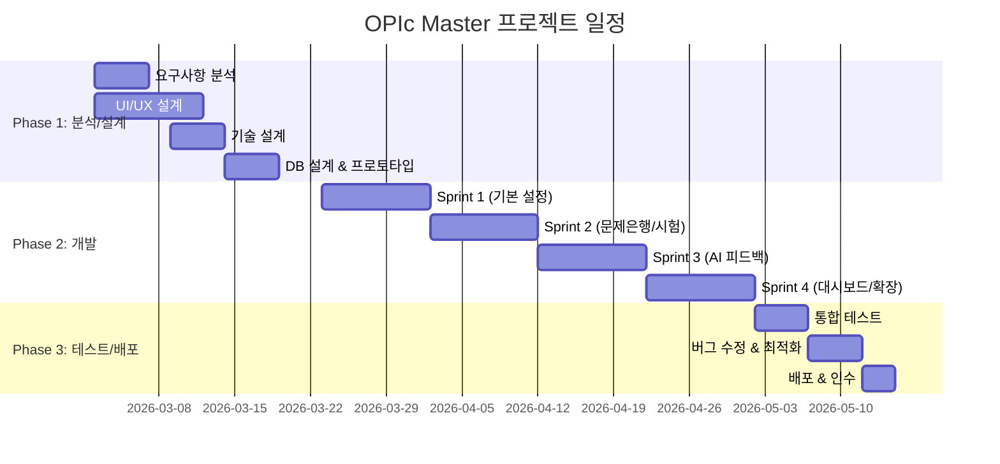

# OPIc Master WBS (Work Breakdown Structure)

**버전**: 1.0
**작성일**: 2026-02-16
**기반 문서**: PRD-20260216-083400, TRD-20260216-084000
**상태**: Draft

---

## 프로젝트 요약

| 항목 | 값 |
|------|-----|
| 총 작업 기간 | 10주 (2.5개월) |
| 총 공수 | 1,440시간 (180 Man-Days / 9.0 Man-Months) |
| 팀 규모 | 5명 |
| 방법론 | Agile (Scrum) |
| 스프린트 주기 | 2주 |
| 버퍼 비율 | 20% |

---

## 1. 프로젝트 단계 (Phases)



### Phase 1: 분석 및 설계
- **기간**: 2026-03-02 ~ 2026-03-20 (3주)
- **목표**: 요구사항 확인, UI/UX 디자인, 기술 설계, DB 스키마 확정
- **산출물**: 화면 설계서, Stitch UI 디자인, DB 스키마 DDL, API 명세서, 프로토타입
- **마일스톤**: M0 — 설계 완료 및 개발 착수 승인

### Phase 2: 개발
- **기간**: 2026-03-23 ~ 2026-05-15 (8주, 4 스프린트)
- **목표**: 전체 기능 구현 (P1 22개 + P2 7개 + P3 확장)
- **산출물**: 동작 가능한 웹 앱 (서베이, 레벨, 문제은행, 모의시험, AI 피드백, 대시보드)
- **마일스톤**: M1(Sprint 1), M2(Sprint 2), M3(Sprint 3), M4(Sprint 4)

### Phase 3: 테스트 및 배포
- **기간**: 2026-05-18 ~ 2026-05-29 (2주)
- **목표**: 통합 테스트, 버그 수정, 성능 최적화, 배포
- **산출물**: 최종 릴리스, 사용자 가이드, 설정 매뉴얼
- **마일스톤**: M5 — 최종 릴리스 및 인수

---

## 2. 작업 패키지 (Work Packages)

### WP-1: 요구사항 분석 및 설계
| ID | 작업명 | 담당 역할 | 예상 공수(시간) | 선행 작업 | 산출물 |
|----|--------|----------|---------------|----------|--------|
| WP-1.1 | PRD 요구사항 상세 검토 | PM/PL | 16h | - | 요구사항 검토 결과서 |
| WP-1.2 | UI/UX 와이어프레임 설계 (9개 화면) | UI/UX | 40h | WP-1.1 | 와이어프레임 |
| WP-1.3 | Google Stitch UI 디자인 (4개 핵심 화면) | UI/UX | 24h | WP-1.2 | Stitch HTML/CSS |
| WP-1.4 | DB 스키마 설계 (8개 테이블) | 백엔드 | 16h | WP-1.1 | schema.sql |
| WP-1.5 | API 엔드포인트 상세 설계 (15개) | 백엔드 | 16h | WP-1.4 | API 명세서 |
| WP-1.6 | Gemini API 시스템 프롬프트 설계 | 백엔드 | 8h | WP-1.1 | 프롬프트 명세서 |
| WP-1.7 | 프로젝트 환경 구성 (Node.js, Express, SQLite) | 백엔드 | 8h | - | 프로젝트 스캐폴딩 |
| WP-1.8 | 초기 데이터 준비 (주제, 레벨, 질문 seed) | PM/PL | 24h | WP-1.4 | seed.sql |

**소계**: 152시간 (19 Man-Days)

---

### WP-2: Sprint 1 — 기본 설정 기능 (FR-001~004, 009~013, 031~032)
| ID | 작업명 | 담당 역할 | 예상 공수(시간) | 선행 작업 | 산출물 |
|----|--------|----------|---------------|----------|--------|
| WP-2.1 | SPA 라우터 및 네비게이션 탭바 구현 | 프론트엔드 | 16h | WP-1.3 | app.js, 탭바 UI |
| WP-2.2 | 앱 타이틀/헤더 구현 | 프론트엔드 | 4h | WP-2.1 | 헤더 컴포넌트 |
| WP-2.3 | 서베이 주제 카드 UI 구현 | 프론트엔드 | 16h | WP-2.1 | survey.js, survey.css |
| WP-2.4 | 레벨 설정 UI 구현 (9단계 선택, 갭 분석) | 프론트엔드 | 20h | WP-2.1 | level.js, level.css |
| WP-2.5 | 다크 모드 글로벌 스타일 적용 | 프론트엔드 | 8h | WP-1.3 | global.css |
| WP-2.6 | Topics API 구현 (GET, PUT) | 백엔드 | 8h | WP-1.5 | routes/topics.js |
| WP-2.7 | Levels API 구현 (GET) | 백엔드 | 4h | WP-1.5 | routes/levels.js |
| WP-2.8 | Settings API 구현 (GET, PUT) | 백엔드 | 8h | WP-1.5 | routes/settings.js |
| WP-2.9 | SQLite DB 초기화 및 seed 데이터 투입 | 백엔드 | 8h | WP-1.8 | database.js, seed.sql |
| WP-2.10 | Sprint 1 통합 테스트 | QA | 8h | WP-2.9 | 테스트 결과 |

**소계**: 100시간 (12.5 Man-Days)

---

### WP-3: Sprint 2 — 문제은행 및 모의시험 (FR-005~008, 014~021)
| ID | 작업명 | 담당 역할 | 예상 공수(시간) | 선행 작업 | 산출물 |
|----|--------|----------|---------------|----------|--------|
| WP-3.1 | 문제은행 화면 구현 (주제별 탭, 질문 목록) | 프론트엔드 | 16h | WP-2.1 | questions.js |
| WP-3.2 | 질문 상세 + 답변 가이드 UI 구현 | 프론트엔드 | 12h | WP-3.1 | 질문 상세 화면 |
| WP-3.3 | 모의시험 대기 화면 구현 | 프론트엔드 | 8h | WP-2.1 | exam.js (대기) |
| WP-3.4 | SVG 원형 타이머 구현 (준비 8초) | 프론트엔드 | 12h | WP-3.3 | timer.js |
| WP-3.5 | 답변 타이머 구현 (90초/120초, 경고 색상) | 프론트엔드 | 12h | WP-3.4 | timer.js (확장) |
| WP-3.6 | 답변 텍스트 입력 + 실시간 단어 수 카운트 | 프론트엔드 | 8h | WP-3.3 | wordcount.js |
| WP-3.7 | 목표 대비 달성률 프로그레스 바 구현 | 프론트엔드 | 6h | WP-3.6 | 달성률 UI |
| WP-3.8 | 시험 결과 요약 화면 구현 | 프론트엔드 | 8h | WP-3.3 | 결과 화면 |
| WP-3.9 | Questions API 구현 (GET, 필터링) | 백엔드 | 12h | WP-2.9 | routes/questions.js |
| WP-3.10 | Answer Guides API 구현 (레벨별 분기) | 백엔드 | 8h | WP-3.9 | guides 응답 |
| WP-3.11 | Exam Start API (5문제 랜덤 구성 로직) | 백엔드 | 12h | WP-3.9 | routes/exam.js |
| WP-3.12 | Exam Sessions API (결과 저장/조회) | 백엔드 | 12h | WP-3.11 | 세션 저장 |
| WP-3.13 | Sprint 2 통합 테스트 | QA | 12h | WP-3.12 | 테스트 결과 |

**소계**: 138시간 (17.3 Man-Days)

---

### WP-4: Sprint 3 — AI 피드백 연동 (FR-022~026)
| ID | 작업명 | 담당 역할 | 예상 공수(시간) | 선행 작업 | 산출물 |
|----|--------|----------|---------------|----------|--------|
| WP-4.1 | Gemini API 서비스 구현 (프롬프트 구성, 호출) | 백엔드 | 16h | WP-1.6 | services/gemini.js |
| WP-4.2 | Gemini 응답 JSON 파싱 및 검증 로직 | 백엔드 | 12h | WP-4.1 | 파싱 로직 |
| WP-4.3 | Feedback API 구현 (프록시, 저장, 조회) | 백엔드 | 12h | WP-4.2 | routes/feedback.js |
| WP-4.4 | API 에러 처리 구현 (429/400/500 분기) | 백엔드 | 8h | WP-4.3 | errorHandler.js |
| WP-4.5 | AI 피드백 요청 UI (로딩 인디케이터) | 프론트엔드 | 8h | WP-3.8 | feedback.js |
| WP-4.6 | 예상 등급 뱃지 및 점수 게이지 시각화 | 프론트엔드 | 16h | WP-4.5 | 점수 게이지 UI |
| WP-4.7 | 잘한 점 / 개선할 점 카드 UI | 프론트엔드 | 8h | WP-4.5 | 피드백 카드 |
| WP-4.8 | 현재→예상→목표 레벨 진행 시각화 | 프론트엔드 | 8h | WP-4.6 | 레벨 진행 UI |
| WP-4.9 | 에러 메시지 UI (재시도 버튼 포함) | 프론트엔드 | 6h | WP-4.4 | 에러 UI |
| WP-4.10 | Sprint 3 통합 테스트 (Gemini API 포함) | QA | 12h | WP-4.9 | 테스트 결과 |

**소계**: 106시간 (13.3 Man-Days)

---

### WP-5: Sprint 4 — 대시보드 및 확장 기능 (FR-027~030, P2/P3)
| ID | 작업명 | 담당 역할 | 예상 공수(시간) | 선행 작업 | 산출물 |
|----|--------|----------|---------------|----------|--------|
| WP-5.1 | Dashboard API 구현 (통계, 추이) | 백엔드 | 12h | WP-4.3 | routes/dashboard.js |
| WP-5.2 | 학습 통계 요약 카드 UI | 프론트엔드 | 8h | WP-5.1 | dashboard.js |
| WP-5.3 | Chart.js 점수 추이 라인 차트 구현 | 프론트엔드 | 12h | WP-5.1 | 차트 UI |
| WP-5.4 | 레벨 진행률 바 구현 | 프론트엔드 | 8h | WP-5.1 | 진행률 UI |
| WP-5.5 | 최근 시험 이력 목록 구현 | 프론트엔드 | 8h | WP-5.1 | 이력 목록 |
| WP-5.6 | 레벨별 최소 단어 수 표시 | 프론트엔드 | 4h | WP-2.4 | 단어 수 표시 |
| WP-5.7 | 레벨별 가이드 분기 개선 | 백엔드 | 8h | WP-3.10 | 가이드 분기 |
| WP-5.8 | 전체 UI 다듬기 및 반응형 기초 | 프론트엔드 | 12h | WP-5.5 | UI 폴리싱 |
| WP-5.9 | Sprint 4 통합 테스트 | QA | 8h | WP-5.8 | 테스트 결과 |

**소계**: 80시간 (10 Man-Days)

---

### WP-6: 테스트 및 배포
| ID | 작업명 | 담당 역할 | 예상 공수(시간) | 선행 작업 | 산출물 |
|----|--------|----------|---------------|----------|--------|
| WP-6.1 | 전체 기능 통합 테스트 (E2E) | QA | 24h | WP-5.9 | 통합 테스트 결과 |
| WP-6.2 | 성능 테스트 (페이지 전환, API 응답, 타이머) | QA | 12h | WP-6.1 | 성능 테스트 보고서 |
| WP-6.3 | 버그 수정 및 코드 정리 | 프론트엔드, 백엔드 | 24h | WP-6.1 | 수정된 코드 |
| WP-6.4 | 성능 최적화 (초기 로딩, DB 쿼리) | 백엔드 | 8h | WP-6.2 | 최적화된 코드 |
| WP-6.5 | 사용자 가이드 작성 (README, 설정 가이드) | PM/PL | 16h | WP-6.3 | README.md, 가이드 문서 |
| WP-6.6 | .env.example, .gitignore, 패키지 정리 | 백엔드 | 4h | WP-6.3 | 배포 준비 파일 |
| WP-6.7 | 최종 인수 테스트 및 릴리스 | PM/PL, QA | 16h | WP-6.5 | 최종 릴리스 |

**소계**: 104시간 (13 Man-Days)

---

## 3. 크리티컬 패스 (Critical Path)

```
WP-1.1 → WP-1.4 → WP-1.5 → WP-2.9 → WP-3.11 → WP-3.12 → WP-4.1 → WP-4.3 → WP-5.1 → WP-6.1 → WP-6.3 → WP-6.7
```

| 단계 | 작업 ID | 작업명 | 공수(시간) | 누적 |
|------|---------|--------|----------|------|
| 1 | WP-1.1 | PRD 요구사항 상세 검토 | 16h | 16h |
| 2 | WP-1.4 | DB 스키마 설계 | 16h | 32h |
| 3 | WP-1.5 | API 엔드포인트 상세 설계 | 16h | 48h |
| 4 | WP-2.9 | SQLite DB 초기화 및 seed | 8h | 56h |
| 5 | WP-3.11 | Exam Start API (5문제 랜덤 구성) | 12h | 68h |
| 6 | WP-3.12 | Exam Sessions API (결과 저장) | 12h | 80h |
| 7 | WP-4.1 | Gemini API 서비스 구현 | 16h | 96h |
| 8 | WP-4.3 | Feedback API 구현 | 12h | 108h |
| 9 | WP-5.1 | Dashboard API 구현 | 12h | 120h |
| 10 | WP-6.1 | 전체 기능 통합 테스트 | 24h | 144h |
| 11 | WP-6.3 | 버그 수정 및 코드 정리 | 24h | 168h |
| 12 | WP-6.7 | 최종 인수 테스트 및 릴리스 | 16h | 184h |

**총 크리티컬 패스 길이**: 184시간 (23 Man-Days)

---

## 4. 리소스 배분 (Resource Allocation)

### 4.1 역할별 투입 계획

| 역할 | 인원 | 주요 담당 작업 | 투입 공수 | 투입률 |
|------|------|---------------|----------|--------|
| PM/PL | 1명 | 요구사항 분석, 초기 데이터 준비, 가이드 작성, 인수 | 72h (9MD) | 18% |
| UI/UX 디자이너 | 1명 (0.5 FTE) | 와이어프레임, Stitch UI 디자인 | 64h (8MD) | 16% |
| 프론트엔드 개발자 | 1명 | SPA 라우터, 전체 화면 UI, 타이머, 차트 | 256h (32MD) | 64% |
| 백엔드 개발자 | 1명 | Express API, SQLite, Gemini 연동 | 208h (26MD) | 52% |
| QA | 1명 (0.5 FTE) | 스프린트별 테스트, 통합/성능 테스트 | 76h (9.5MD) | 19% |

### 4.2 주차별 투입 현황

| 주차 | PM/PL | UI/UX | 프론트엔드 | 백엔드 | QA |
|------|-------|-------|-----------|--------|-----|
| W1 (분석) | ● | ● | - | ○ | - |
| W2 (설계) | ○ | ● | - | ● | - |
| W3 (설계/환경) | ○ | ○ | - | ● | - |
| W4 (Sprint 1) | ○ | - | ● | ● | ○ |
| W5 (Sprint 1) | - | - | ● | ● | ○ |
| W6 (Sprint 2) | - | - | ● | ● | ○ |
| W7 (Sprint 2) | - | - | ● | ● | ○ |
| W8 (Sprint 3) | - | - | ● | ● | ○ |
| W9 (Sprint 4) | - | - | ● | ● | ○ |
| W10 (테스트/배포) | ● | - | ○ | ○ | ● |

(● 전담, ○ 부분 투입, - 미투입)

---

## 5. 공수 요약 (Effort Summary)

### 5.1 단계별 공수

| 단계 | 공수 (시간) | Man-Days | 비율 |
|------|-----------|----------|------|
| 분석/설계 (Phase 1) | 152 | 19.0 | 21.3% |
| Sprint 1: 기본 설정 | 100 | 12.5 | 14.0% |
| Sprint 2: 문제은행/시험 | 138 | 17.3 | 19.3% |
| Sprint 3: AI 피드백 | 106 | 13.3 | 14.8% |
| Sprint 4: 대시보드/확장 | 80 | 10.0 | 11.2% |
| 테스트/배포 (Phase 3) | 104 | 13.0 | 14.6% |
| **소계** | **680** | **85.0** | **100%** |
| PM 관리 공수 | 72 | 9.0 | - |
| UI/UX 공수 | 64 | 8.0 | - |
| **작업 합계** | **816** | **102.0** | - |
| 버퍼 (20%) | 163 | 20.4 | - |
| **총계** | **979** | **122.4** | - |

### 5.2 Man-Month 환산

- 1 Man-Day = 8시간
- 1 Man-Month = 20 Man-Days = 160시간
- **총 공수**: 979시간 = 122.4 Man-Days = **6.1 Man-Months**

---

## 6. 리스크 및 가정사항

### 가정사항
- 개발 인력이 해당 기술 스택(HTML/CSS/JS, Node.js, Express, SQLite)에 충분한 경험이 있음
- Gemini API Key 발급 및 환경 설정이 프로젝트 시작 전 완료됨
- Google Stitch를 통한 UI 디자인 산출물이 HTML/CSS로 내보내기 가능함
- 문제은행 초기 데이터(주제당 5개+ 질문)는 AI 또는 수동으로 사전 준비됨
- 1일 근무 시간은 8시간 기준
- 별도의 클라우드/서버 인프라 구축 없이 로컬 환경에서 실행

### 일정 리스크
| 리스크 | 영향 | 대응 방안 |
|--------|------|----------|
| Gemini API 응답 형식 변경/불안정 | HIGH | 응답 검증 로직 강화, 폴백 템플릿 준비. Sprint 3 초반에 API 연동 검증 |
| Stitch 디자인↔코드 통합 충돌 | MEDIUM | 컴포넌트 단위 분리 적용, 필요 시 직접 CSS 작성으로 전환 |
| 초기 데이터(질문/가이드) 준비 지연 | MEDIUM | Phase 1에서 PM이 seed 데이터를 병행 준비. 최소 50개 질문 확보 목표 |
| 프론트엔드 UI 복잡도 과다 (9개 화면) | MEDIUM | P1 화면 우선 개발, P2/P3 화면은 Sprint 4에서 처리 |
| SQLite 동시 접근 이슈 | LOW | WAL 모드 활성화, 단일 사용자 앱이므로 실질적 리스크 낮음 |

---

## 7. 참고 문서

- 기반 PRD: `workspace/outputs/prd/PRD-20260216-083400.json`
- 기반 TRD: `workspace/outputs/trd/TRD-20260216-084000.json`

---
*이 문서는 WBS 자동 생성 시스템에 의해 작성되었습니다.*
